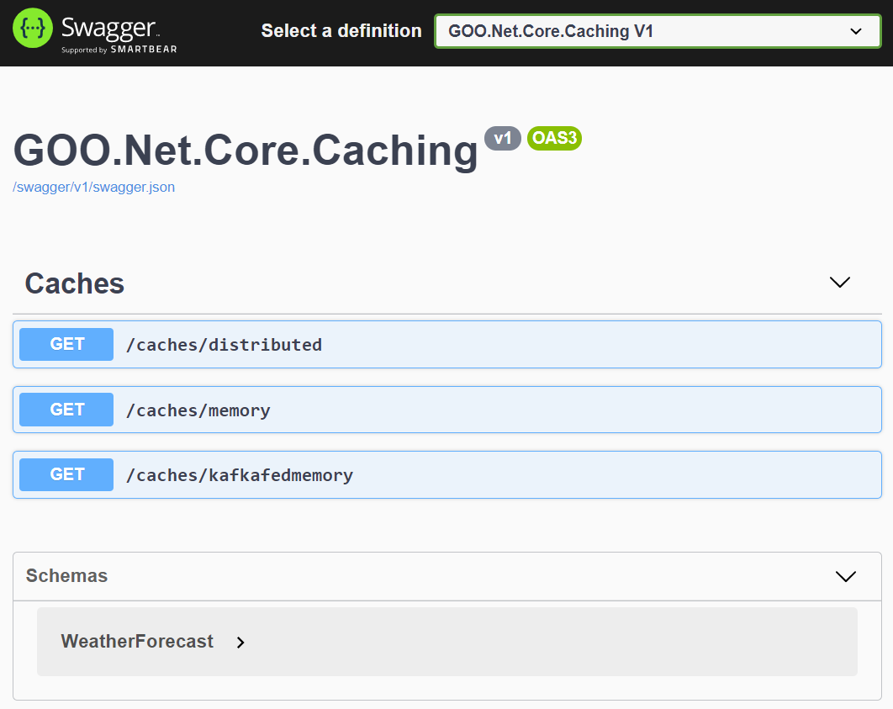

# Getting Started

### Docker:

First things first, install Docker for your operating system. Instructions for [Windows](https://docs.docker.com/docker-for-windows/install/), [Mac](https://docs.docker.com/docker-for-mac/install/) and [Linux](https://docs.docker.com/docker-for-mac/install/) are readily available available.

### Docker Compose:

Next, open a command line shell, switch to the main project directory and run `docker-compose up`. This will start up all the backing services required for the code to run. These are defined in the [docker-compose.yml](../src/docker-compose.yml) file.

Additional details regarding docker-compose can be found [here](https://docs.docker.com/compose/).

### Run Application:

There are numerous tutorials on how to run to .NET applications if you're new to the ecosystem. However, the basic steps below.

- Install and start [Visual Studio](https://docs.microsoft.com/en-us/visualstudio/install/install-visual-studio)
- Open the solution file [GOO.Net.Core.Caching.sln](../src/GOO.Net.Core.Caching.sln) in Visual Studio
- Run the project

### Swagger:

When creating RESTful apis, swagger is one of the easiest tools that helps new develpers get started with your APIs. Not going to go into the intricasies of using swagger, plenty of documentation can be found online. See [here](https://www.blazemeter.com/blog/getting-started-with-swagger-ui/) for examples and [here](https://swagger.io/tools/swagger-ui/) live demos.

